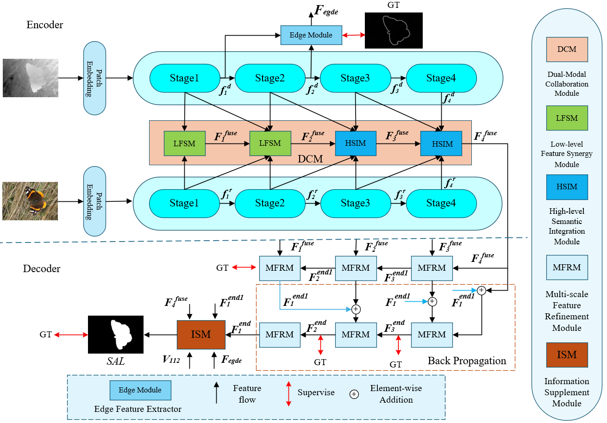
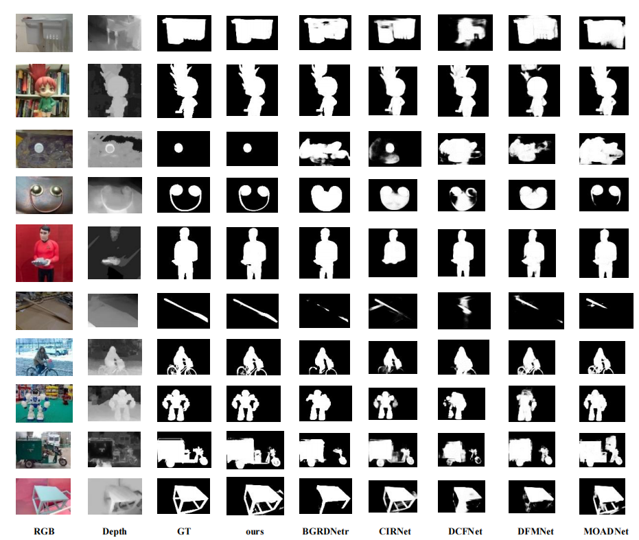
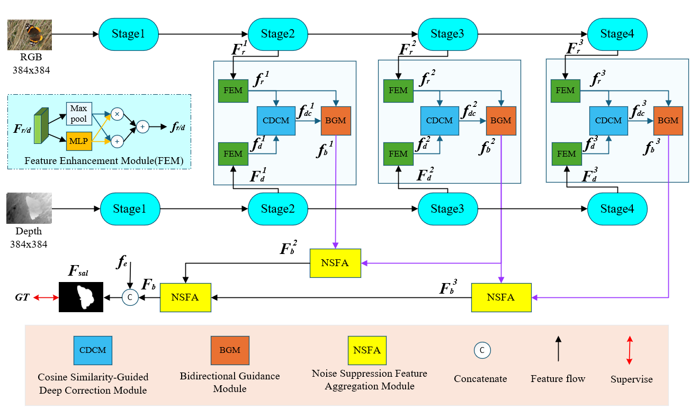
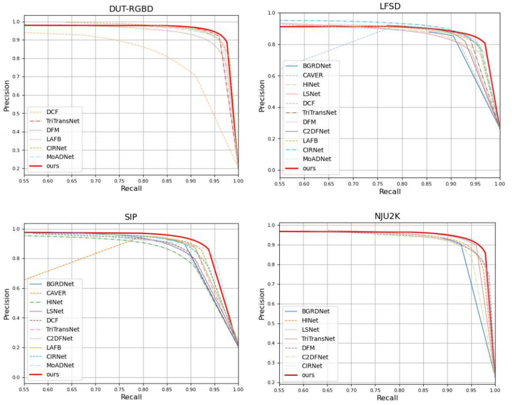
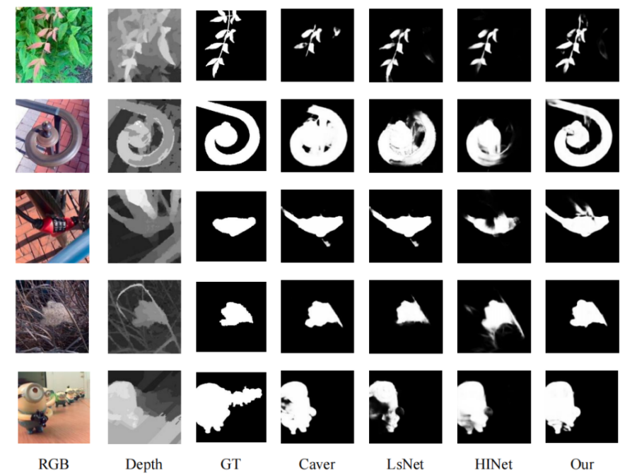

# COOPNet
# -----------------------模型架构---------------------------------

# ------------------------pr曲线---------------------------------------

# -------------------------sal------------------------------------

# DCBGNet
# ----------------------模型架构------------------------------

# ----------------------pr曲线----------------------------------

# -----------------------sal-------------------------------

# The significance map and weights of rgbd/rgbt can be found here：

链接: https://pan.baidu.com/s/1u06UnxJerSGwbnghKILRbQ?pwd=ipm1 提取码: ipm1
